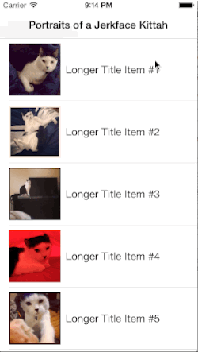

DNSSwipeableTableCell
====
----

This is an extension of [a tutorial I wrote](http://www.raywenderlich.com/62435/make-swipeable-table-view-cell-actions-without-going-nuts-scroll-views) for [RayWenderlich.com](http://www.raywenderlich.com) on how to create a swipeable UITableViewCell for iOS 7 without driving yourself completley insane with UIScrollViews. (Drive yourself insane with constraints instead!)
 
The crux of the problem is that while adding a delete button is super-easy, adding a delete button AND another button is a total nightmare because of the way the cells are constructed. 

I've refactored the code that was included in the tutorial, which is is more meant as an exercise in helping n00bs dive into figuring out how Apple's code works under the hood, into this library, which I'm hoping will be helpful for anyone dealing with this in production code. 

##The Biggest Changes
* Removed dependency on the storyboard
* Made the `myContentView` public so the cell could be subclassed and recycled more easily.
* Beefed up delegate to handle an arbitrary number of buttons
* Added datasource to allow tons of user-configurable options
* Tweaked the animation so it uses spring damping instead of trying to do that manually
* Added a ton of documentation to the swipeable cell class
* Cleaned up the sample app quite a bit
* Added a sample subclass.
* Added a bunch of photos of my cat, because the internet loves cats. 

##//TODOs
* ??? - File an issue!

##Additional Contributors
* [Mark Flowers](https://github.com/markflowers) - Improved fixes for tableview slop, removed index path hack, defaults for numerous previously required methods, and better delegate methods.

##Photos
All photos Copyright Ellen Shapiro. If you want to see more photos of my jerkface cat, Chaplin, follow me on [Instagram](http://instagram.com/loudguitars).